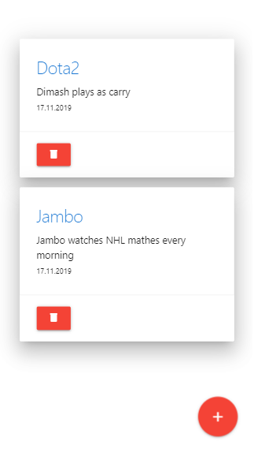
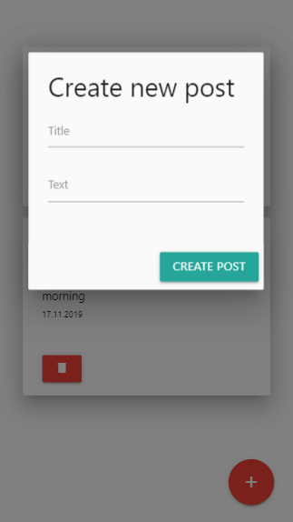
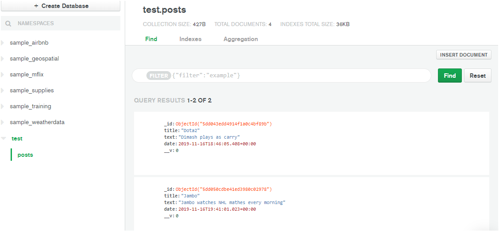

# CoolBlog

Simple blog on Node.js &amp; Express.js just with methods GET, POST, DELETE 

**1)Main page**

    

**2)Create new post**

    

**3)My MongoDB**

    

## Files to install:

1. nmp install express
2. npm install nodemon -D
3. npm install mongoose
4. npm install body-parser

